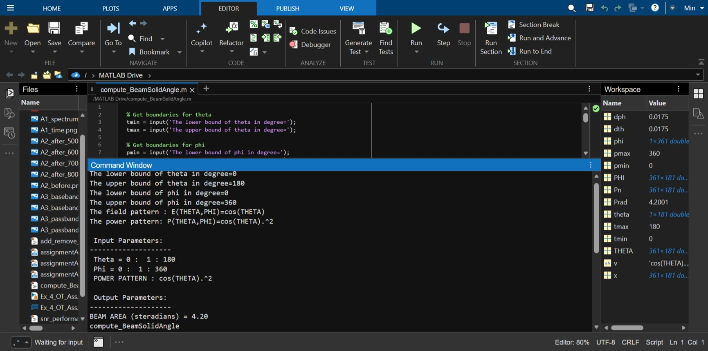

# Beam Solid Angle Calculator

## What This Code Does
This MATLAB script calculates the beam solid area of an antenna. It computes this by doing numerical integration (adding up small pieces of the area over a grid) based on the radiation pattern formulas you input.

## Explanation of Inputs
When you run the script, it will ask you for several values:
* **Theta and Phi Bounds:** The starting and ending angles (in degrees). These set the limits for the area the script will calculate.
* **Field Pattern (E):** The mathematical equation for the electric field.
* **Power Pattern (P):** The mathematical equation for the power. 

## How to Run
1. Make sure this README, your MATLAB script (e.g., `beam_solid_angle.m`), and the screenshot image (`Screenshot_27-3-2026_145444_matlab.mathworks.com.jpeg`) are all saved in the exact same folder.
2. Open the script in MATLAB and click **Run**.
3. Type the requested values into the Command Window and press Enter after each one.

## Example Test Case
To verify the code works and get the required target of **2.10 Sr**, enter these exact values when prompted:

* **The lower bound of theta in degree=** 0
* **The upper bound of theta in degree=** 90
* **The lower bound of phi in degree=** 0
* **The upper bound of phi in degree=** 360
* **The field pattern : E(THETA,PHI)=** cos(THETA)
* **The power pattern: P(THETA,PHI)=** cos(THETA).^2
